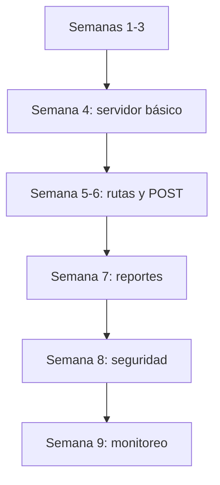
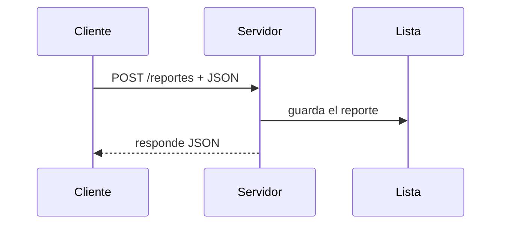

# Programadores para la Paz

Trabajo del curso **Programadores para la Paz** (Colombia 2026).

Aquí van las actividades de la semana 1 a la 9. Al inicio son preguntas, reflexiones y comandos de terminal. Desde la semana 4 aparecen servidores hechos con Node.js y Express.

## Estructura

```text
semana1/   preguntas, reflexión, algoritmo
semana2/   terminal
semana3/   git
semana4/   primer servidor
semana5/   rutas GET y POST
semana6/   JSON y APIs
semana7/   reportes en memoria
semana8/   linux y seguridad
semana9/   estado del servidor
```

## Avance del curso



## Cómo correr un servidor

Entrar a la carpeta de la semana, e instalar dependencias si hace falta (Son en si instalar Node.js y npm).

```bash
cd semana9
npm install
node server.js
```

El puerto asignado para montar el servidor es el **3000** en todas las semana. Aquí quiero aclarar que como se indica con los códigos de las tareas, se monta código para que que solo una implementación de servidor pueda estar activa a la vez.


| Semana | Rutas principales |
|--------|-------------------|
| 4 | `GET /` |
| 5 | `GET /`, `/saludo`, `/mensaje/:nombre`, `POST /reporte` |
| 6 | `POST /registro`, `POST /incidencia` |
| 7 | `GET /reportes`, `POST /reportes` |
| 9 | `GET /`, `GET /estado` |

## Petición POST (ejemplo semana 7)



Ejemplo con curl:

```bash
curl -X POST http://localhost:3000/reportes \
  -H "Content-Type: application/json" \
  -d '{"tipo":"Infraestructura","descripcion":"Daño en alumbrado público"}'
```

## Publicar cambios

```bash
git status
git add .
git commit -m "Actividad semana X"
git push
```

## Semana 9

Con el servidor encendido:

- `http://localhost:3000/` muestra un mensaje de texto
- `http://localhost:3000/estado` devuelve JSON

Si el navegador no muestra bien el JSON, probar con `curl http://localhost:3000/estado`es algo que a mi me sirvio.

## Nota sobre semana 7

Los reportes se guardan en memoria. Si se reinicia el servidor, la lista quedará vacía nuevamente xd.

## Licencia

GNU GPL v3 — ver [LICENSE](LICENSE).


Trabajo hecho por Helmut Chaparro Sandoval
Cualquier pregunta o inquietud puedes escribirme a helmut.chs@gmail.com o al número (+57)3008723290